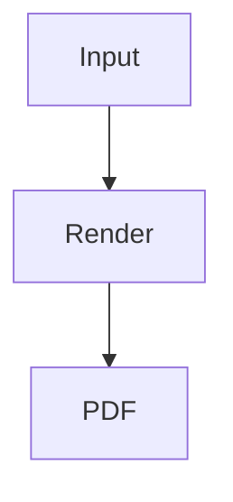

# SKILL.md

## Skill: Convert Markdown to PDF with Images

This document describes the core product skill implemented by this repository: converting Markdown into a production-quality PDF while preserving images, tables, code blocks, and Mermaid diagrams.

---

## Goal

Given user input like this:

````md
# Report

This is a Markdown report.




````

The system must produce a PDF where:

- Headings are styled correctly.
- Tables are readable.
- Code blocks keep formatting.
- Mermaid diagrams are rendered as actual diagrams.
- Images are embedded correctly.
- HTML is sanitized.
- Output is downloadable from the frontend.

---

## Product Flow

```txt
User Markdown + Assets
        |
        v
Frontend validation and upload
        |
        v
NestJS Render Endpoint
        |
        v
Application Use Case
        |
        +--> Parse Markdown
        +--> Extract Mermaid blocks
        +--> Resolve local/remote images
        +--> Render diagrams
        +--> Build sanitized HTML
        +--> Render HTML to PDF
        |
        v
PDF bytes returned to client
        |
        v
Download PDF
```

---

## Backend Skill Contract

### Input

The backend accepts one of these payloads:

#### JSON mode

```json
{
  "markdown": "# Hello\n\n",
  "options": {
    "pageSize": "A4",
    "margin": "16mm",
    "theme": "github-light",
    "renderMermaid": true,
    "allowRemoteImages": true
  }
}
```

#### Multipart mode

Use multipart when local images are uploaded together with Markdown.

```txt
markdown: string
options: JSON string
assets[]: image files
```

Markdown can reference uploaded assets using:

```md

```

---

## Output

For a render request, the backend returns:

```txt
Content-Type: application/pdf
Content-Disposition: attachment; filename="document.pdf"
```

For a preview request, the backend returns:

```json
{
  "html": "<article>...</article>",
  "metadata": {
    "diagramCount": 2,
    "imageCount": 3,
    "wordCount": 1200
  }
}
```

---

## Clean Architecture Skill Boundary

### Domain Layer

The domain layer knows what a Markdown document, render job, render option, asset, and PDF result are.

It must not know how to use Puppeteer, Mermaid, Express, or Vercel.

Recommended domain objects:

```txt
MarkdownDocument
RenderJob
RenderOptions
DocumentAsset
PdfResult
DiagramBlock
```

### Application Layer

The application layer coordinates the skill.

Main use case:

```txt
RenderMarkdownToPdfUseCase
```

The use case depends only on ports:

```txt
MarkdownParserPort
DiagramRendererPort
ImageResolverPort
HtmlSanitizerPort
PdfRendererPort
DocumentStoragePort
```

### Infrastructure Layer

Infrastructure implements the actual rendering details.

Recommended adapters:

```txt
RemarkMarkdownParserAdapter
MermaidSvgRendererAdapter
SafeRemoteImageResolverAdapter
UploadedImageResolverAdapter
ChromiumPdfRendererAdapter
MemoryDocumentStorageAdapter
```

### Presentation Layer

The presentation layer exposes the skill over HTTP.

Recommended controller:

```txt
MarkdownPdfController
```

Recommended routes:

```txt
POST /markdown-pdf/render
POST /markdown-pdf/preview
POST /markdown-pdf/inspect
```

---

## Rendering Pipeline

### Step 1: Validate Request

Reject early when:

- Markdown is empty.
- Markdown exceeds max size.
- Too many assets are uploaded.
- Asset size exceeds limit.
- Unsupported MIME type is detected.
- Remote image URL is not allowed.

### Step 2: Parse Markdown

Use a Markdown parser adapter to convert Markdown into an internal HTML representation.

Recommended capabilities:

- GitHub-Flavored Markdown.
- Tables.
- Task lists.
- Fenced code blocks.
- Raw HTML disabled or sanitized.

### Step 3: Render Mermaid

Find fenced blocks with language `mermaid`.

For each block:

1. Validate diagram size.
2. Render diagram to SVG or PNG.
3. Replace the original code block with a figure element.
4. Keep alt text or caption metadata where possible.

### Step 4: Resolve Images

For each image reference:

1. Check whether it is an uploaded asset, remote URL, or data URL.
2. Validate file type and size.
3. Convert it to a safe URL or data URI usable by the PDF renderer.
4. Preserve alt text.

### Step 5: Sanitize HTML

Sanitize all generated HTML.

Allowed elements should include:

```txt
article, section, h1-h6, p, strong, em, blockquote,
ul, ol, li, table, thead, tbody, tr, th, td,
pre, code, figure, figcaption, img, a, hr
```

Blocked elements:

```txt
script, iframe, object, embed, form, input, button
```

### Step 6: Apply Print CSS

Recommended default CSS rules:

```css
@page {
  size: A4;
  margin: 16mm;
}

body {
  font-family: system-ui, -apple-system, BlinkMacSystemFont, "Segoe UI", sans-serif;
  line-height: 1.55;
}

img, svg {
  max-width: 100%;
  height: auto;
}

pre, table, figure {
  break-inside: avoid;
}

pre {
  white-space: pre-wrap;
  overflow-wrap: anywhere;
}
```

### Step 7: Render PDF

Recommended production adapter:

```txt
ChromiumPdfRendererAdapter
```

For Vercel serverless compatibility, prefer:

```txt
puppeteer-core + @sparticuz/chromium
```

The adapter should:

- Set content using sanitized HTML.
- Wait for images and fonts to load.
- Render PDF using print media.
- Enforce timeout.
- Return PDF bytes.

---

## Error Handling

Use structured errors.

Example:

```json
{
  "code": "IMAGE_NOT_FOUND",
  "message": "Markdown references attachment://diagram.png, but no uploaded asset matches that filename.",
  "details": {
    "reference": "attachment://diagram.png"
  }
}
```

Common error codes:

```txt
MARKDOWN_EMPTY
MARKDOWN_TOO_LARGE
UNSUPPORTED_IMAGE_TYPE
IMAGE_TOO_LARGE
IMAGE_NOT_FOUND
REMOTE_IMAGE_BLOCKED
MERMAID_RENDER_FAILED
HTML_SANITIZATION_FAILED
PDF_RENDER_TIMEOUT
PDF_RENDER_FAILED
```

---

## Security Checklist

Before rendering:

- [ ] Markdown size is checked.
- [ ] Uploaded image count is checked.
- [ ] Uploaded image size is checked.
- [ ] MIME type is sniffed.
- [ ] Remote image URLs are validated.
- [ ] SSRF protections are active.
- [ ] Raw HTML is sanitized.
- [ ] JavaScript is disabled in rendered content.
- [ ] Render timeout is enforced.
- [ ] Temporary files are cleaned up.

---

## Quality Checklist

A valid PDF must satisfy:

- [ ] Text is not clipped.
- [ ] Code blocks wrap safely.
- [ ] Tables fit within the page or degrade gracefully.
- [ ] Images appear in the expected location.
- [ ] Mermaid diagrams are rendered as diagrams, not raw code.
- [ ] Page margins are consistent.
- [ ] Output filename is safe.
- [ ] PDF bytes are returned with correct headers.

---

## Suggested Test Fixtures

Create these fixtures under:

```txt
server/test/fixtures/markdown-pdf/
```

Recommended files:

```txt
basic.md
with-table.md
with-code-block.md
with-local-image.md
with-remote-image.md
with-mermaid.md
with-raw-html.md
large-document.md
blocked-remote-image.md
```

Each fixture should have an expected behavior:

```txt
basic.md                 -> should render
with-table.md            -> should render table
with-code-block.md       -> should preserve code formatting
with-local-image.md      -> should embed uploaded image
with-remote-image.md     -> should embed allowed remote image
with-mermaid.md          -> should render diagram
with-raw-html.md         -> should sanitize unsafe HTML
large-document.md        -> should reject if over limit
blocked-remote-image.md  -> should reject by security policy
```

---

## Implementation Priority

### MVP

1. JSON Markdown input.
2. Basic Markdown to HTML.
3. Sanitized HTML.
4. Chromium PDF rendering.
5. Download PDF from frontend.

### Next

6. Uploaded image support.
7. Mermaid rendering.
8. Remote image resolver with SSRF protection.
9. Preview HTML endpoint.
10. Render options and themes.

### Later

11. Job-based async rendering.
12. Vercel Blob/S3 persistence.
13. PDF history.
14. Visual regression tests.
15. Templates and brand themes.
