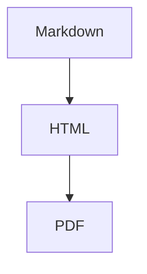

# GETTING_STARTED.md

## Overview

This repository is a monorepo for a Markdown-to-PDF application with image and diagram support.

- `server/` contains the NestJS backend.
- `client/` contains the Next.js frontend.
- Both apps are intended to be deployable to Vercel.
- The backend follows Clean Architecture and uses feature modules, controller/service/use-case boundaries, provider tokens, and infrastructure adapters.

---

## Prerequisites

Install:

- Node.js 20+
- npm 10+
- Git
- Vercel CLI, optional for deployment testing

```bash
npm i -g vercel
```

---

## Clone Repository

```bash
git clone <your-repository-url>
cd markdown-to-pdf
```

---

## Recommended Monorepo Structure

```txt
markdown-to-pdf/
├── client/
├── server/
├── AGENTS.md
├── SKILL.md
├── GETTING_STARTED.md
└── CONTRIBUTING.md
```

---

# Backend Setup: NestJS

## 1. Go to Server Directory

```bash
cd server
```

## 2. Install Dependencies

```bash
npm install
```

Recommended backend dependencies:

```bash
npm install @nestjs/common @nestjs/core @nestjs/platform-express @nestjs/swagger @nestjs/throttler class-transformer class-validator reflect-metadata rxjs express
npm install unified remark-parse remark-gfm remark-rehype rehype-stringify rehype-sanitize
npm install puppeteer-core @sparticuz/chromium
```

Recommended dev dependencies:

```bash
npm install -D @nestjs/cli @nestjs/testing typescript ts-node ts-jest jest supertest eslint prettier @types/node @types/express
```

## 3. Environment Variables

Create `server/.env`:

```env
NODE_ENV=development
PORT=3001
CLIENT_ORIGIN=http://localhost:3000
MAX_MARKDOWN_BYTES=1048576
MAX_IMAGE_BYTES=5242880
MAX_IMAGE_COUNT=20
PDF_RENDER_TIMEOUT_MS=30000
ALLOW_REMOTE_IMAGES=false
```

For production on Vercel, set these variables in the Vercel project settings.

## 4. Backend Vercel Entry Point

Create:

```txt
server/src/api/index.ts
```

Example shape:

```ts
import express from 'express';
import { NestFactory } from '@nestjs/core';
import { ExpressAdapter } from '@nestjs/platform-express';
import { ValidationPipe } from '@nestjs/common';
import { AppModule } from '../app.module';

const server = express();

async function bootstrap() {
  const app = await NestFactory.create(AppModule, new ExpressAdapter(server));

  app.enableCors({
    origin: process.env.CLIENT_ORIGIN,
    credentials: true,
  });

  app.useGlobalPipes(
    new ValidationPipe({
      whitelist: true,
      forbidNonWhitelisted: true,
      transform: true,
    }),
  );

  await app.init();
}

const bootstrapPromise = bootstrap();

export default async function handler(req: unknown, res: unknown) {
  await bootstrapPromise;
  return server(req as never, res as never);
}
```

## 5. Vercel Config

Create `server/vercel.json`:

```json
{
  "version": 2,
  "builds": [
    {
      "src": "src/api/index.ts",
      "use": "@vercel/node"
    }
  ],
  "routes": [
    {
      "src": "/(.*)",
      "dest": "src/api/index.ts",
      "methods": ["GET", "POST", "PUT", "PATCH", "DELETE", "OPTIONS"]
    }
  ]
}
```

## 6. Run Backend Locally

```bash
npm run start:dev
```

Expected local backend URL:

```txt
http://localhost:3001
```

---

# Frontend Setup: Next.js

## 1. Go to Client Directory

```bash
cd ../client
```

## 2. Install Dependencies

```bash
npm install
```

Recommended frontend dependencies:

```bash
npm install next react react-dom zod
npm install @uiw/react-md-editor react-dropzone
```

Recommended dev dependencies:

```bash
npm install -D typescript eslint prettier @types/node @types/react @types/react-dom
```

## 3. Environment Variables

Create `client/.env.local`:

```env
NEXT_PUBLIC_API_BASE_URL=http://localhost:3001
```

## 4. Run Frontend Locally

```bash
npm run dev
```

Expected local frontend URL:

```txt
http://localhost:3000
```

---

# First End-to-End Test

## 1. Start Backend

Terminal 1:

```bash
cd server
npm run start:dev
```

## 2. Start Frontend

Terminal 2:

```bash
cd client
npm run dev
```

## 3. Test Markdown Input

Paste this into the frontend editor:

````md
# Markdown PDF Test

This is a sample document.

| Feature | Status |
| ------- | ------ |
| Markdown | OK |
| Table | OK |
| PDF | OK |


````

Click **Generate PDF**.

Expected result:

- A PDF is downloaded.
- The table is visible.
- The Mermaid diagram is rendered as an image, not raw code.

---

# Backend API Contract

## Render PDF

```txt
POST /markdown-pdf/render
```

Example JSON request:

```json
{
  "markdown": "# Hello PDF",
  "options": {
    "pageSize": "A4",
    "margin": "16mm",
    "theme": "github-light",
    "renderMermaid": true,
    "allowRemoteImages": false
  }
}
```

Expected response:

```txt
Content-Type: application/pdf
Content-Disposition: attachment; filename="document.pdf"
```

## Preview HTML

```txt
POST /markdown-pdf/preview
```

Expected response:

```json
{
  "html": "<article>...</article>",
  "metadata": {
    "diagramCount": 1,
    "imageCount": 0
  }
}
```

## Inspect Markdown

```txt
POST /markdown-pdf/inspect
```

Expected response:

```json
{
  "metadata": {
    "headingCount": 1,
    "diagramCount": 1,
    "imageCount": 0,
    "tableCount": 1
  }
}
```

---

# Development Commands

Run from `server/`:

```bash
npm run start:dev
npm run lint
npm run test
npm run test:e2e
npm run build
```

Run from `client/`:

```bash
npm run dev
npm run lint
npm run build
```

---

# Deployment to Vercel

## Backend

```bash
cd server
vercel
```

Set production environment variables in Vercel.

Important:

- Configure the backend project as a Node.js serverless app.
- Confirm that `src/api/index.ts` is the serverless entrypoint.
- Confirm Chromium dependencies work in the Vercel runtime if using Puppeteer.

## Frontend

```bash
cd client
vercel
```

Set:

```env
NEXT_PUBLIC_API_BASE_URL=https://your-backend.vercel.app
```

---

# Common Issues

## Mermaid appears as code instead of diagram

Cause:

- Mermaid renderer adapter is not wired.
- `renderMermaid` is false.
- Diagram renderer failed but fallback is configured to show code.

Fix:

- Check `DiagramRendererPort` provider binding.
- Check render logs.
- Add fixture test for `with-mermaid.md`.

## Images are missing in PDF

Cause:

- Markdown references an attachment that was not uploaded.
- Remote image fetching is disabled.
- Image URL was blocked by security policy.
- Image type is unsupported.

Fix:

- Use `attachment://filename.png` for uploaded assets.
- Enable remote images only when safe.
- Check `ImageResolverPort` result.

## Works locally but fails on Vercel

Cause:

- Local filesystem assumption.
- Chromium binary missing.
- Function timeout.
- Payload too large.

Fix:

- Use `/tmp` only for temporary files.
- Use `puppeteer-core` with a serverless-compatible Chromium package.
- Reduce PDF complexity.
- Move large assets to Blob/S3-like storage.

---

# Recommended First Milestone

Build the MVP in this order:

1. Create `server/src/api/index.ts` and verify NestJS deploys to Vercel.
2. Create `MarkdownPdfModule`.
3. Add `RenderMarkdownToPdfUseCase`.
4. Add Markdown parser adapter.
5. Add HTML sanitizer adapter.
6. Add Chromium PDF renderer adapter.
7. Add `POST /markdown-pdf/render`.
8. Create a simple Next.js page with editor and download button.
9. Add uploaded image support.
10. Add Mermaid support.
